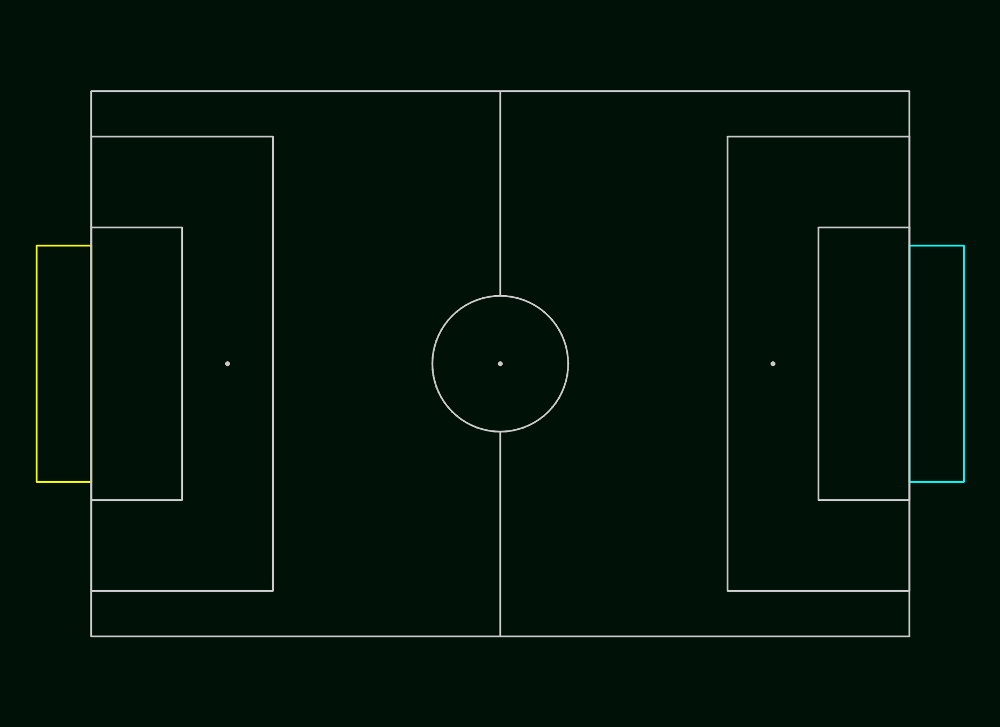
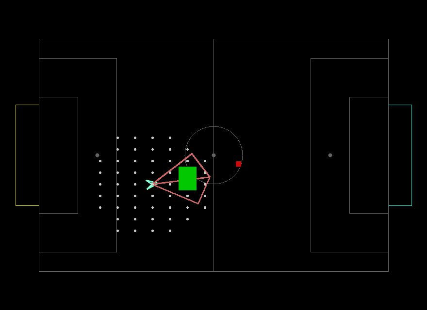

# Behavior-Modules
in Order to Visualize Behavior Modules We Use Soccer Playground that Previously Created by Junior Members, Behavior Modules Contains Functions that Controls Robot Position and Direction with Purpose
## Current Behavior Modules
* Robots Visualizer
  * [ ] Single / Multiple Robot Visualizer
* Path Planning Algorithms
  * [ ] A*
  * [ ] BFS and DFS
  * [ ] Obstacle Avoidance
  * [ ] Robot's Intesection Area
* Movement Handler
  * [ ] Robot Direction in [Radian](https://en.wikipedia.org/wiki/Radian)
  * [ ] [Transformation Matrix](https://en.wikipedia.org/wiki/Transformation_matrix)
  * [ ] [Acceleration](https://en.wikipedia.org/wiki/Acceleration)
  * [ ] [Velocity](https://en.wikipedia.org/wiki/Velocity)
## Overview
There are related modules to handle Path Planning and Movements of Robot and for Robot that is on Playground, We have Attributes Like :
* Robot's Shape (Based on Sample in [Assets Directory](Assets/robot.png))
* Position on [Cartesian Coordinate System](https://en.wikipedia.org/wiki/Cartesian_coordinate_system)
* Robot's Velocity and Acceleration
* Robot's Direction in Radian
* Robot's Name

  
  

